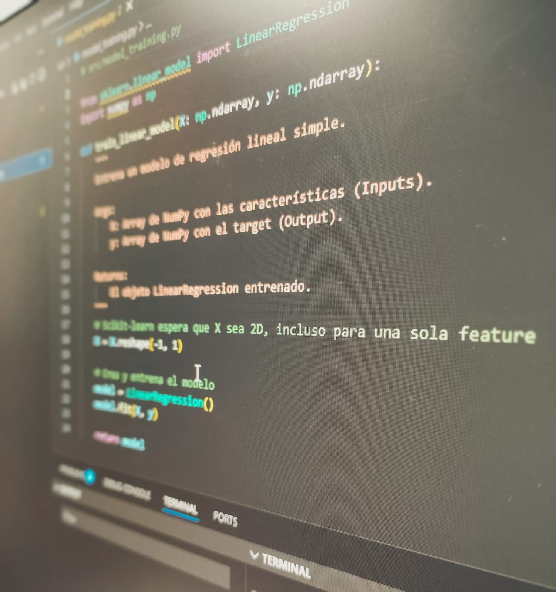

# Programming for Data Science Foundations

## Main Topics

### Consoles and Environment Managers

**Consoles:** A console such as CMD (Command Prompt) or PowerShell is a text-based command line interface (CLI) that allows you to interact directly with the Windows operating system, executing tasks, managing files, and automating processes using written commands instead of clicks. They act as an interpreter between the user and the system. 

- [01 - cmd basics 🔳](Consoles_and_Environment_Managers/cmd.md)
- [02 - PowerShell basics 💻](Consoles_and_Environment_Managers/Powershell.md)
- [03 - Automation Script and Project Entry Point (runall.ps1) 🤖](Automation_script.md)

**Environment managers:** A virtual environment and software package manager allows you to create isolated workspaces for programming projects, mainly in Python and R. By installing only the essentials, dependency conflicts between libraries are avoided and version management is facilitated. Channels are used for the installation of interpreters and libraries/packages (channels are repositories where this software is stored). 

- [04 - Conda environment management basics 🐍](Consoles_and_Environment_Managers/Conda.md)
- [05 - venv environment management basics 🐉](Consoles_and_Environment_Managers/venv.md)

